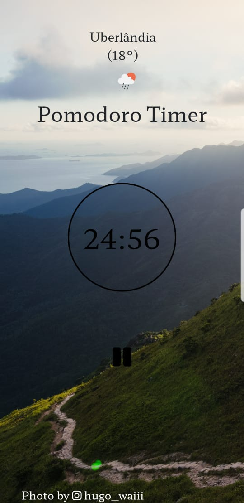

# Pomodoro Timer

- Uma página web para me auxiliar nos meus estudos utilizando o método Pomodoro;

- Consome uma API do unsplash para buscar imagens aleatórias para deixar a página com um ambiente mais harmonioso;

- Abaixo estão algumas imagens do pwa em execução:

  

  

  

